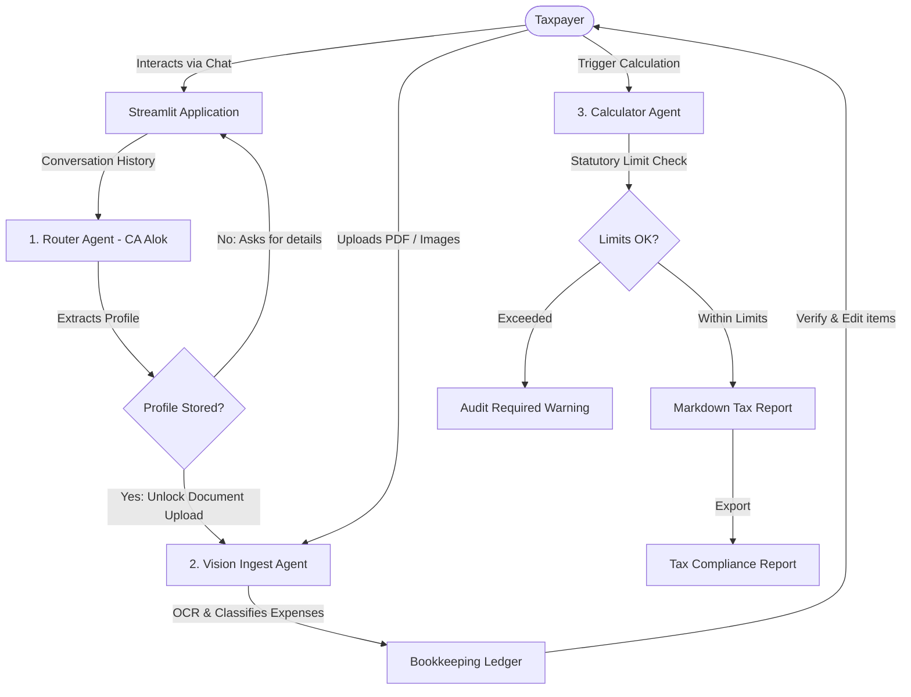

# 💼 Indian Presumptive Tax Assistant
### *A Multi-Agent AI System for Sec 44ADA & Sec 44AD Compliance*

[](https://streamlit.io/)
[](https://deepmind.google/technologies/gemini/)
[](https://docs.pydantic.dev/)
[](https://www.docker.com/)

An enterprise-grade, agentic AI compliance assistant designed to help **Independent Contractors (Sec 44ADA)** and **Small Businesses (Sec 44AD)** in India automate presumptive tax calculations. It dynamically guides users through tax onboarding, ingests invoices/receipts using multimodal vision parsing, organizes a bookkeeping ledger, and generates audit-ready compliance reports.

---

## 🏗️ Multi-Agent Architecture

The application is powered by an orchestrator coordinating three specialized agents:



### 1. 👤 Router Agent (CA Alok)
- **File**: [`agents/router_agent.py`](agents/router_agent.py)
- **Role**: Onboard the taxpayer and dynamically build a validated user profile.
- **Model**: `gemini-2.0-flash` with Pydantic-enforced structured outputs.
- **Details**: Captures taxpayer name, assessment year, presumptive tax track (Professional vs. Small Business), gross turnover, and GST registration details (including GSTIN).

### 2. 👁️ Vision Agent (Document Parser)
- **File**: [`agents/vision_agent.py`](agents/vision_agent.py)
- **Role**: Ingestion and automated OCR of receipts and invoices.
- **Model**: Multimodal `gemini-2.0-flash`.
- **Details**: Detects PDF and image uploads, converts files, extracts transaction details (date, vendor, amount, GST component, GST rate, payment mode), and performs automated tax classification (e.g. Pure Business, Pure Personal, Mixed, Unresolved).

### 3. 🧮 Calculator Agent
- **File**: [`agents/calculator_agent.py`](agents/calculator_agent.py)
- **Role**: Mathematical rules engine and professional report generation.
- **Model**: `gemini-2.0-flash`.
- **Details**: 
  - Verifies statutory caps (₹75 Lakhs under Sec 44ADA for Professionals; ₹3 Crores under Sec 44AD for Businesses).
  - Performs presumptive tax rules (50% flat income for professionals; 6% on digital turnover and 8% on cash turnover for small businesses).
  - Compiles a robust, audit-ready PDF/Markdown tax report detailing eligible Input Tax Credits (ITC) and net tax liabilities.

### 🛠️ Gemini API Resilience & Fallback Engine
- **Implementation**: [`agents/utils.py`](agents/utils.py)
- **Role**: Prevents application crashes from free-tier rate limits or transient Google AI Studio outages.
- **Details**:
  - Automatically cascades API calls across fallback models: `gemini-2.5-flash-lite` ➔ `gemini-2.0-flash-lite` ➔ `gemini-2.0-flash` ➔ `gemini-3.5-flash`.
  - Implements **exponential backoff retries** for temporary quota/network errors (`429` / `RESOURCE_EXHAUSTED` or `503` / `UNAVAILABLE`).

---

## 📂 Repository Structure

```
├── .streamlit/
│   └── config.toml           # Streamlit server config (static serving)
│
├── agents/
│   ├── calculator_agent.py   # Presumptive tax logic & report compiling
│   ├── router_agent.py       # Onboarding conversation & profile extractor
│   ├── vision_agent.py       # Multimodal receipt/invoice parser
│   └── utils.py              # Gemini fallback caller & PDF generator
│
├── schemas/
│   ├── models.py             # Pydantic v2 schemas for structured IO
│   ├── taxpayer_profile.json # Schema specification for taxpayer metadata
│   └── financial_document.json
│
├── prompts/
│   ├── router_agent.txt      # System instructions for onboarding
│   ├── vision_agent.txt      # System instructions for document OCR/classification
│   └── calculator_agent.txt  # Instructions for compiling reports
│
├── docs/
│   └── workspace_setup.md    # IDE and developer setup guide
│
├── static/                   # Static resources directory
├── data/                     # Upload directory for tax invoices
├── reports/                  # Generated compliance outputs
├── app.py                    # Streamlit Web Interface (Premium UI)
├── requirements.txt          # Python dependencies
├── Dockerfile                # Production-ready container config
└── README.md                 # Project documentation (this file)
```

---

## ⚡ Quick Start

### Prerequisites
- Python 3.11+
- [Poppler](https://poppler.freedesktop.org/) (required by `pdf2image` for PDF rendering)
  - **macOS**: `brew install poppler`
  - **Linux (Ubuntu/Debian)**: `sudo apt-get install poppler-utils`
  - **Windows**: Download binaries and add them to your system PATH.

### 1. Installation
Clone the repository and install the dependencies:
```bash
git clone https://github.com/sharatkumar-dev/Capstone-Project.git
cd Capstone-Project
python -m venv venv
source venv/bin/activate  # On Windows use: venv\Scripts\activate
pip install -r requirements.txt
```

### 2. Configuration
Create a `.env` file in the root directory:
```env
GEMINI_API_KEY=your-gemini-api-key-here
```

### 3. Run the App
Launch the Streamlit web interface:
```bash
python -m streamlit run app.py --server.port=8080 --server.address=127.0.0.1 --browser.gatherUsageStats=false
```
Open your browser and navigate to `http://127.0.0.1:8080`.

---

## 🐳 Docker Deployment

The application includes a production-ready, multi-stage `Dockerfile` configured to run headlessly on Cloud Run or any container registry.

### Build the Docker Image
```bash
docker build -t presumptive-tax-assistant .
```

### Run the Docker Container
Ensure you pass your Gemini API key as an environment variable:
```bash
docker run -p 8080:8080 -e GEMINI_API_KEY="your-gemini-api-key-here" presumptive-tax-assistant
```
The app will be accessible at `http://localhost:8080`.

---

## 🛡️ Data Privacy & Security
- **Secrets Management**: Secrets and API keys are strictly loaded via `.env` files and are excluded from version control via `.gitignore`.
- **Statutory Limits Compliance**: The agent checks for gross revenue limits and refuses computation if standard limits (e.g. ₹75L / ₹3Cr) are breached, warning users that a mandatory **Section 44AB** audit is required.

---

## 📄 License
This project is licensed under the MIT License.
